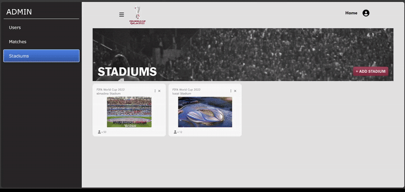

# 🏆 Qatar World Cup 2022


## Prerequisites

- Node.js <= v20.0.0
- Postgres

## Installing

Frontend Side

```bash
~$ cd ./Front-end
~$ npm install
```

Backend Side

```bash
~$ cd ./Back-end
~$ npm install
~$ npm run build
```

After installing Postgres run migrate command to init the database

```bash
~$ npm run db-migrate:up
```

## How to run

Backend

```bash
~$ npm run start:prod
```

Frontend

```bash
~$ npm start
```

# Screenshots

### Home page


### Login page


### Signup page


### Match page


### Approve Users


### Add or Remove Matchs


### Add Stadium



### Reserve Ticket


